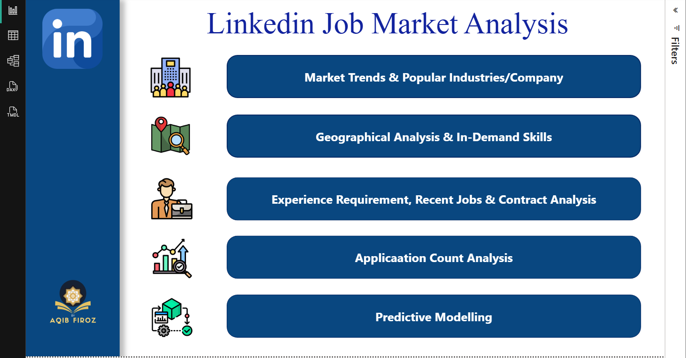
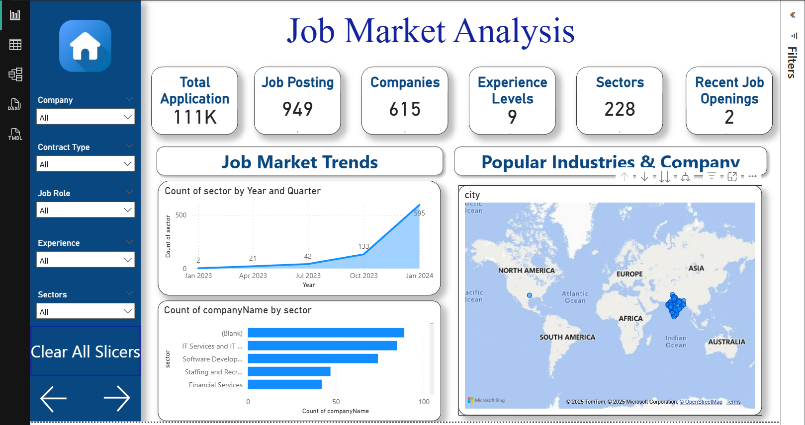
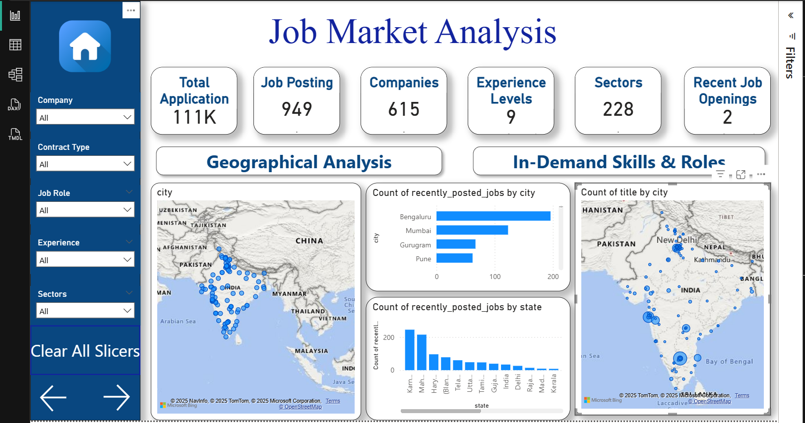
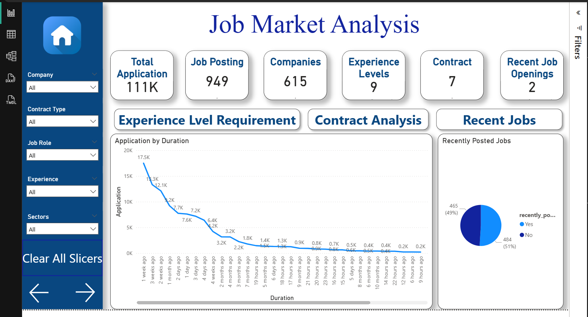
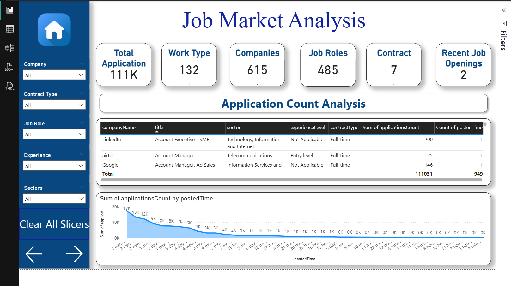

# 📊 LinkedIn Job Market Analysis - Power BI Report

## Project Overview
This project presents a comprehensive Business Intelligence (BI) analysis of the LinkedIn job market, providing deep insights into hiring trends, geographical demand, in-demand skills, and application competitiveness. The analysis is built using **Power BI** and leverages a dataset scraped or collected from LinkedIn job postings.

The primary goal is to empower job seekers, recruiters, and policymakers with data-driven insights to understand the current employment landscape and predict future market direction.

## Report Walkthrough
Here's a visual tour of the key pages within the Power BI report:

### 1. Navigation & Overview
The landing page serves as an intuitive guide to the various analytical sections of the report.

### 2. Market Trends & Popular Industries/Company
Dive into the overall job market dynamics, identifying trending industries and the companies with the most active hiring.

 

### 3. Geographical Analysis & In-Demand Skills
Explore job distribution across different regions and uncover the most sought-after skills in specific geographical areas.

### 4. Experience Requirement, Recent Jobs & Contract Analysis
Understand the demand for various experience levels, review recent job postings, and analyze the prevalence of different contract types.

### 5. Application Count Analysis
Gain insights into job competitiveness by analyzing the number of applications per role, helping to identify highly contested positions.

*(Note: The "Predictive Modelling" page is not explicitly shown in the current screenshots but is a planned/implemented advanced feature discussed in the Key Areas of Analysis.)*

## Key Areas of Analysis
The Power BI report is structured into several interactive pages, each focusing on a specific dimension of the job market:

| Report Page | Focus Area | Key Visualizations |
| :--- | :--- | :--- |
| **Market Trends** | Overall job volume, growth, and popular industries/companies. | Time-series trend lines, top N bar charts. |
| **Geographical Analysis** | Location-based demand, and regional skill needs. | Filled Maps (Choropleth), Top City/State Rankings. |
| **In-Demand Skills** | Most frequently requested skills from job descriptions. | Word Cloud / Treemap of top technical and soft skills. |
| **Experience & Contract** | Distribution of jobs by seniority (Entry, Mid-Senior, etc.) and contract type (Full-Time, Contract). | Donut charts, Waterfall charts showing experience distribution. |
| **Application Analysis** | Competitiveness of jobs, identifying over-applied-to roles. | Tables and KPIs showing **Average Applications per Job**. |
| **Predictive Modelling** | Forecasts for future job demand based on historical data. | Line chart showing **Forecasted Job Postings** with confidence intervals. |

## Data Source & Methodology

* **Data Source:** LinkedIn Job Postings (Specify how you collected the data, e.g., "Web Scraped using Python/Scrapy," or "API data from [Platform Name]").
* **Time Period:** [Specify Date Range, e.g., "January 1, 2024 to September 30, 2024"]
* **Location Focus:** [e.g., "Primarily India (Cities like Bengaluru, Mumbai) and select global locations."]
* **Data Cleaning/Transformation:** Performed using **Power Query (M Language)** to handle missing values, standardize job titles, and extract skills from job description text.
* **Modeling & Calculations:** Key metrics (e.g., Application Rate, Year-over-Year Growth) were calculated using **DAX (Data Analysis Expressions)**.

## How to View the Report
There are two ways to interact with this analysis:

1.  **Online (Recommended):** View the live, published report on the Power BI Service:
    * [https://app.powerbi.com/links/YwM4fJGj1r?ctid=dcf438c2-e741-4ece-822c-7f42d4d45380&pbi_source=linkShare]
2.  **Locally:** Download and explore the source file:
    * Clone this repository.
    * Open the file: `[Project.pbix]` using **Power BI Desktop**.
    * *(Note: The report may require a connection to the original data source for full data refresh, but all visuals are baked into the provided PBIX file.)*

## Future Enhancements
* Integrate salary data for a complete economic analysis.
* Implement Row-Level Security (RLS) for sharing with different regional managers.
* Set up an automated nightly refresh pipeline using Power Automate or Azure Data Factory.

## Author
Aqib Firoz
* **LinkedIn:** [https://www.linkedin.com/in/aqib-firoz/]
* **Email:** [aqibs.d.33@gmail.com]
